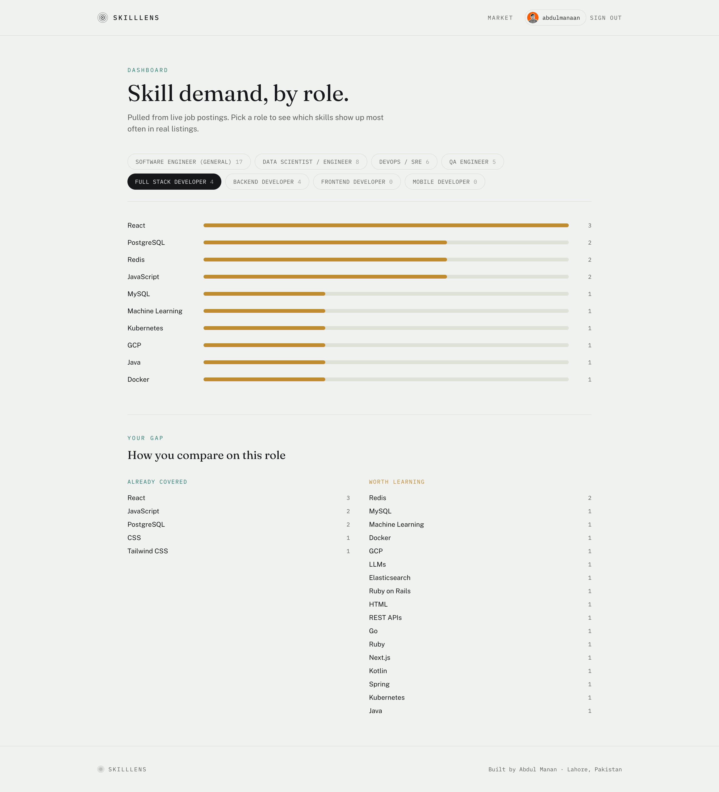

# SkillLens

**Know what the market wants. See what you're missing.**

SkillLens analyzes live developer job postings to show which skills are
actually in demand, broken down by role. Connect your GitHub account to
get a personal skill-gap report comparing your repositories against real
market demand.

Live app: https://skilllense-ten.vercel.app   
API docs: https://skilllens.fastapicloud.dev/docs



## Why

Fresh graduates and job seekers often guess what to learn next. SkillLens
replaces guessing with data pulled from real, live job postings.

## Features

- **Live market data.** Job postings are fetched daily from Adzuna and
  Remotive, filtered to relevant tech roles, and stored in PostgreSQL.
- **Skill extraction.** A regex-based matcher (not a black-box model)
  detects named technologies and frameworks in each posting, with
  word-boundary and false-positive handling for short skill names.
- **Role classification.** Postings are grouped into roles (Backend,
  Frontend, Mobile, Data, DevOps, QA) using title keywords, with skills
  as a tiebreaker only when a role is already confidently matched.
  Postings with no confident signal are left unclassified rather than
  guessed.
- **GitHub OAuth.** Real third-party authentication with signed JWT
  sessions, CSRF-protected via OAuth state validation.
- **Skill-gap analysis.** A user's GitHub repositories are scanned for
  languages and technologies, then compared against market demand for
  a chosen role to show what's already covered and what's worth
  learning next.
- **Automated refresh.** A scheduled GitHub Actions workflow calls a
  protected backend endpoint daily to keep job data current, with no
  manual steps required.

## Tech stack

**Backend**
- Python 3.12, FastAPI, Strawberry GraphQL, SQLAlchemy 2.0 (async)
- PostgreSQL, hosted on Neon
- Alembic for schema migrations
- httpx for external API calls
- PyJWT for session tokens
- uv for dependency and environment management

**Frontend**
- React (Vite)
- Tailwind CSS v4
- React Router

## Getting started locally

### Backend

```bash
cd backend
uv sync
uv run alembic upgrade head
uv run uvicorn app.main:app --reload
```

### Frontend

```bash
cd frontend
npm install
npm run dev
```

### Environment variables

Backend (`backend/.env`):
```bash
DATABASE_URL=
ADZUNA_APP_ID=
ADZUNA_APP_KEY=
GITHUB_CLIENT_ID=
GITHUB_CLIENT_SECRET=
GITHUB_REDIRECT_URI=
JWT_SECRET=
ADMIN_API_KEY=
FRONTEND_URL=
```

Frontend (`frontend/.env`):
```bash
VITE_API_URL=
```

See `.env.example` in each folder for reference.

## Author

**Abdul Manan** · Software Engineer
[GitHub](https://github.com/abdulmanaan) · [LinkedIn](https://www.linkedin.com/in/helloabdulmanan/)

---